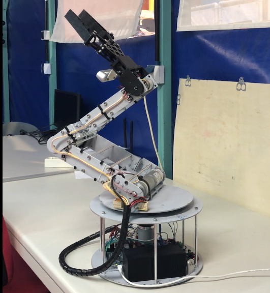
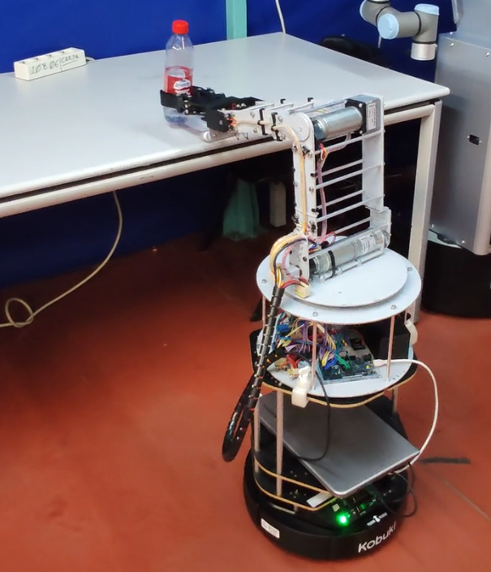

# robotic-arm-development
Design and development of a robust 4-DoF robotic arm from scratch. The project covers both HW and SW implementations and was carried out during my days in the RoboticsLab of the UC3M of Madrid.

General specs:
 - 4 links powered by brushed DC planetery gear motors
 - Maximum payload of 350 g
 - Reach of up to 80 cm
 - Total weight of 6.5 kg
 - Maximum power consumption 80 W
 - 12V Li-Po battery (autonomy not tested)
 - 32-bit ARM core processing unit (Arduino Due as a SCB)
 - RealSense D435 depth camera for manipulation purposes attached to the gripper
 - 300 mm base footprint

The main objective was to develop a reliable and low-cost robotic arm capable of manipulating everyday objects such as soda cans, smartphones, small bottles, etc. Several control algorithms were implemented, including direct and inverse kinematics, low-level motor controllers, an initialization sequence, and communication with ROS via USB. All of this software was designed to run on the microcontroller and be driven by a high-level ROS control system.

A matlab script was used to test and assess the derived equations and kinematics algorithms before coding them into the microcontroller.

You can find more info about HW componentes and development in the next link:
https://www.hackster.io/rubinsan/robotic-arm-development-from-scratch-4b2db1

In the left VIDEO, you can see the initialization algorithm (necessary to obtain absolute axis positions) followed by linear movements of the gripper during a test run.
On the left side, and using the capabilities of the arm, it was also possible to build a mobile manipulator using a Turtlebot base. You can see a demo here.

<a href="https://youtu.be/iZUxTX9gKQQ">
</>

<a href="https://youtu.be/L_XmpxMjzE8">
</>
